# Architecture

How the agent is put together: how data gets in, how it is processed, what
comes out, and **where you put your own information**. The written checklist
for adapting the agent to your group is [ADAPTING.md](ADAPTING.md), and the full list of inputs is [INPUTS.md](INPUTS.md).

Colour key used in every diagram: **yellow** you fill in, **red** secrets or
safety, **blue** shipped agent machinery, **purple** Claude's decisions,
**grey** external services, **green** what the agent produces.

To re-render a diagram after editing its Mermaid source below, save the block
to a file and run `npx @mermaid-js/mermaid-cli -i diagram.mmd -o
docs/images/<name>.png -s 2 -b white`. The overview image is built by
`python3 docs/images/src/build_overview.py`, then the SVG is rendered to PNG
at 2x.

---

## 1. The whole system on one page

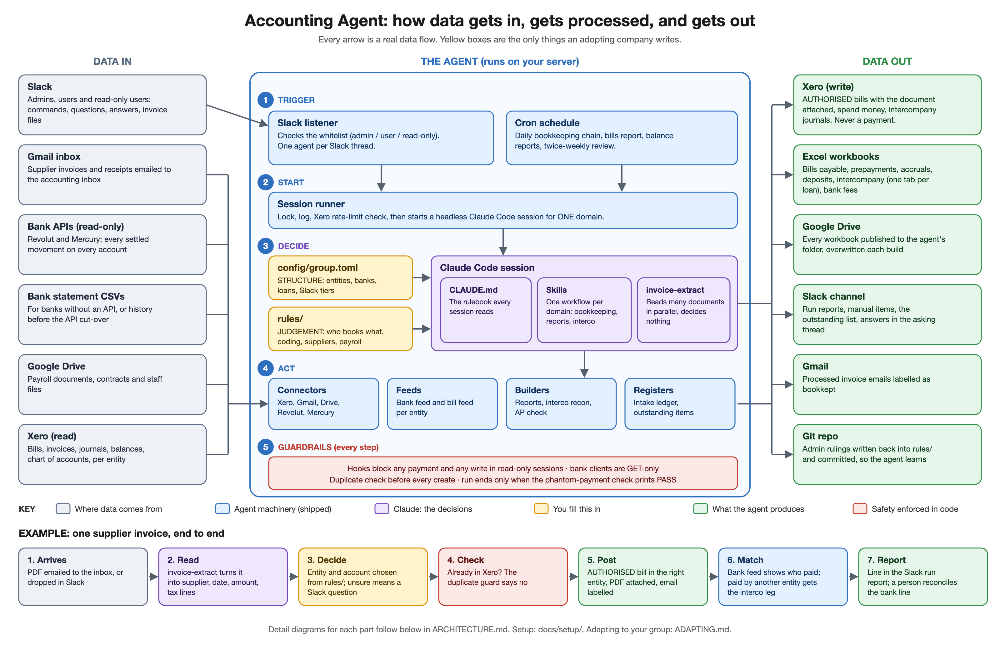

**In one sentence:** Slack messages and cron start headless Claude Code
sessions on a server. Each session loads one domain's skill, reads your
group's structure from `config/group.toml` and your bookkeeping judgement
from `rules/`, works through Python clients against Xero, Gmail, Drive and
the banks, writes Excel workbooks, and reports back into one Slack channel.

---

## 2. Where YOUR information goes

Three places, and only three. Everything else is shipped code and method.

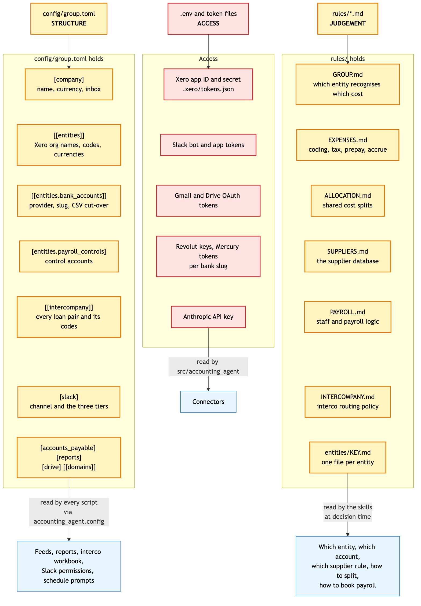

Diagram source (Mermaid, edit this and re-render)

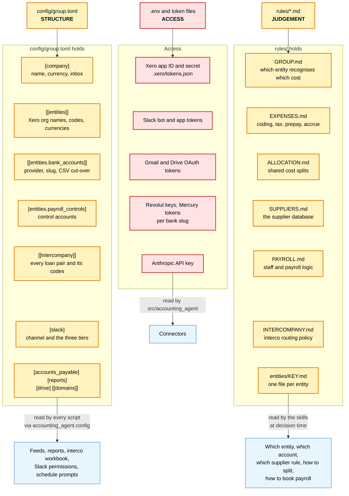

| You want to... | Edit | Picked up by |
|---|---|---|
| Add or remove an entity | `config/group.toml` `[[entities]]` + a `rules/entities/<KEY>.md` | every feed, report, the interco matrix, Slack prompts, the schedule |
| Add a bank account | `[[entities.bank_accounts]]` (+ credentials in `.env`) | bank feed, bills report, bank fees, phantom check |
| Add an intercompany loan | `[[intercompany]]` | interco recon, the matrix, one new line-by-line tab, FX revaluation |
| Say who books which cost | `rules/GROUP.md`, `rules/ALLOCATION.md` | the bookkeeping run (`xero-bills`) |
| Code a cost category to an account | `rules/EXPENSES.md` | the bookkeeping run, the review |
| Teach it a supplier | `rules/SUPPLIERS.md` | the bookkeeping run, the bills report |
| Change payroll handling | `rules/PAYROLL.md` + `[entities.payroll_controls]` | bookkeeping, the payroll control check |
| Give someone Slack access | `[slack.admins]` / `[slack.users]` / `[slack.readonly]` | the listener, on restart |

Admins can also change `rules/` from Slack: a ruling sent to the bot is
written into the right rules file by the run and committed on the server
(`deploy/commit-writeback.sh`).

---

## 3. Repository map

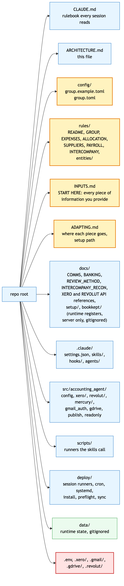

Diagram source (Mermaid, edit this and re-render)

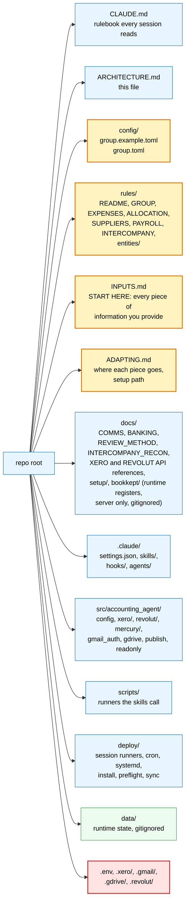

---

## 4. Domains, skills and what they load

One domain per run. A run that is doing bookkeeping does not read report
logic, and the other way round, so a decision in one is never made on the
other's rules. Domains are listed in `config/group.toml` `[[domains]]`; add
your own there.

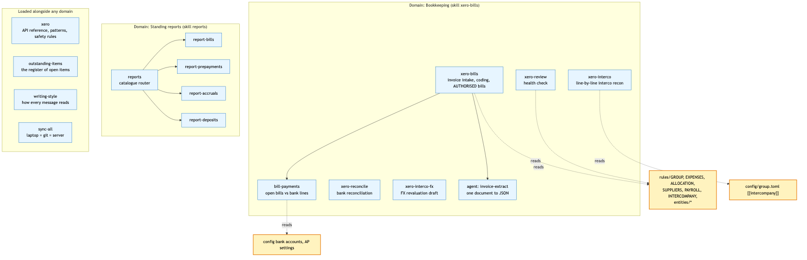

Diagram source (Mermaid, edit this and re-render)

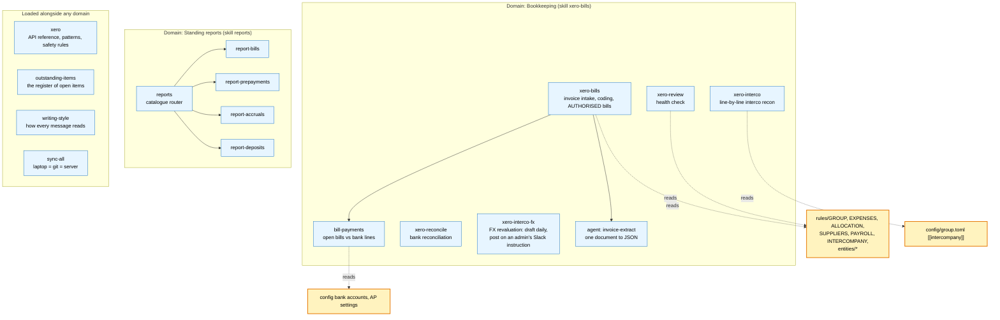

---

## 5. A bookkeeping run, step by step

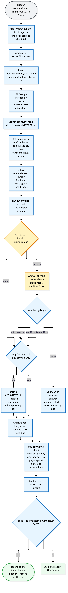

Diagram source (Mermaid, edit this and re-render)

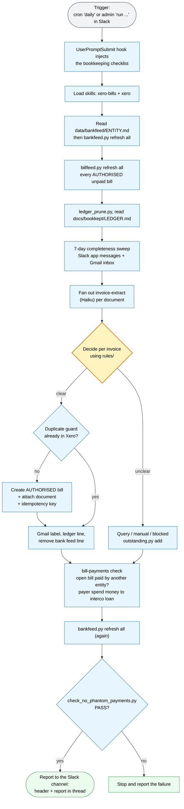

The agent **never creates a payment**. It stops at an AUTHORISED, unpaid
bill with its document attached; the bank feed imports into Xero on its own,
and a person matches the statement line to the bill.

---

## 6. The bank as the source of truth

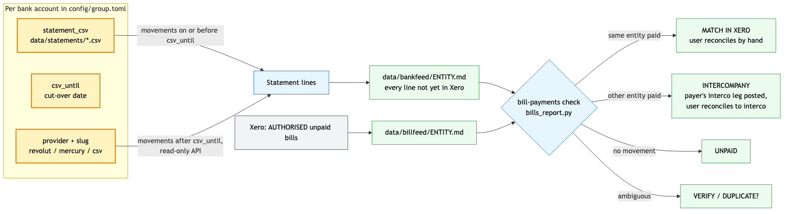

Diagram source (Mermaid, edit this and re-render)

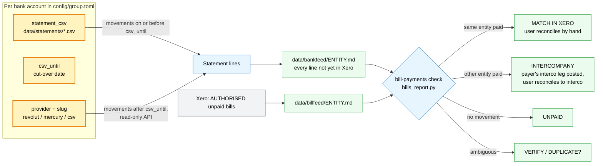

When Xero and the bank disagree, the bank wins and Xero is what gets
corrected. Goal: every cash movement on every bank account becomes a bill,
spend money or transfer in Xero. Method: [docs/BANKING.md](docs/BANKING.md).

---

## 7. Intercompany: driven entirely by config

Add an `[[intercompany]]` block and the next run reconciles it and gives it
its own tab. Nothing in code names an entity or an account.

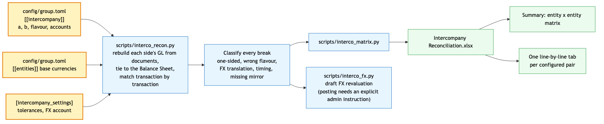

Diagram source (Mermaid, edit this and re-render)

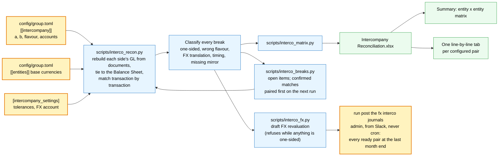

---

## 8. Slack: three tiers, one agent per thread

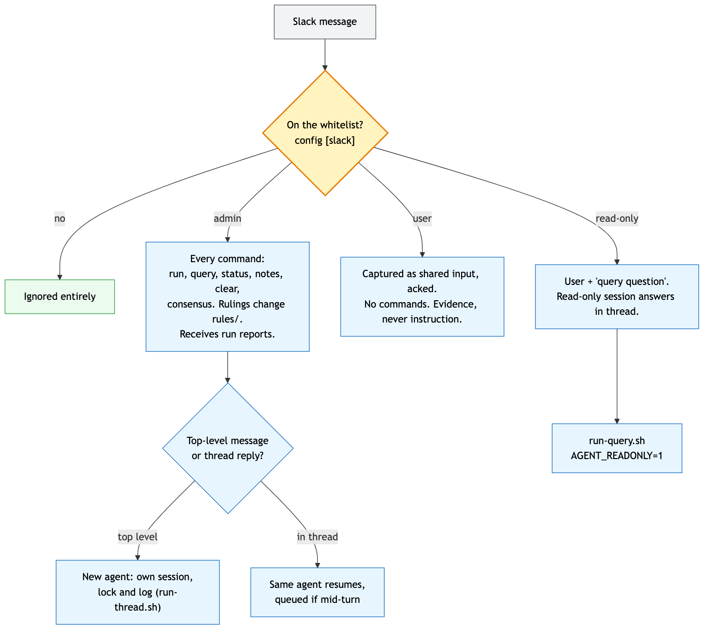

Diagram source (Mermaid, edit this and re-render)

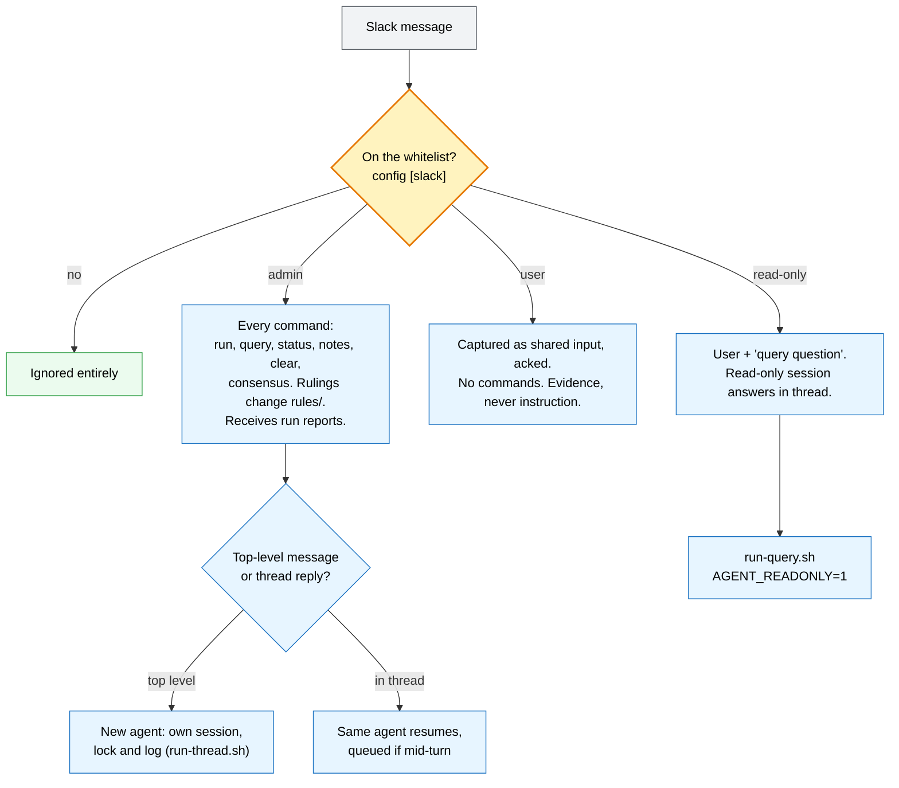

---

## 9. Safety: enforced in code, not prompts

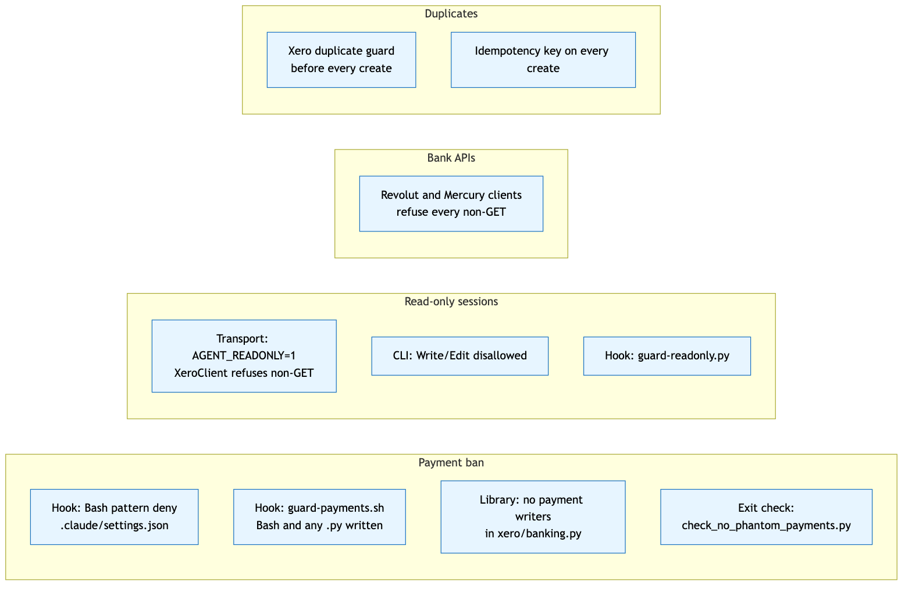

Diagram source (Mermaid, edit this and re-render)

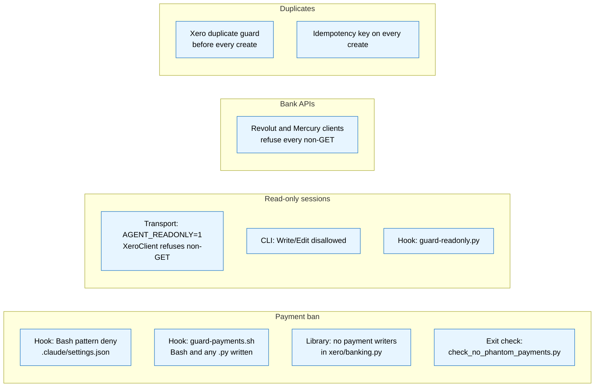

---

## 10. The schedule (UTC)

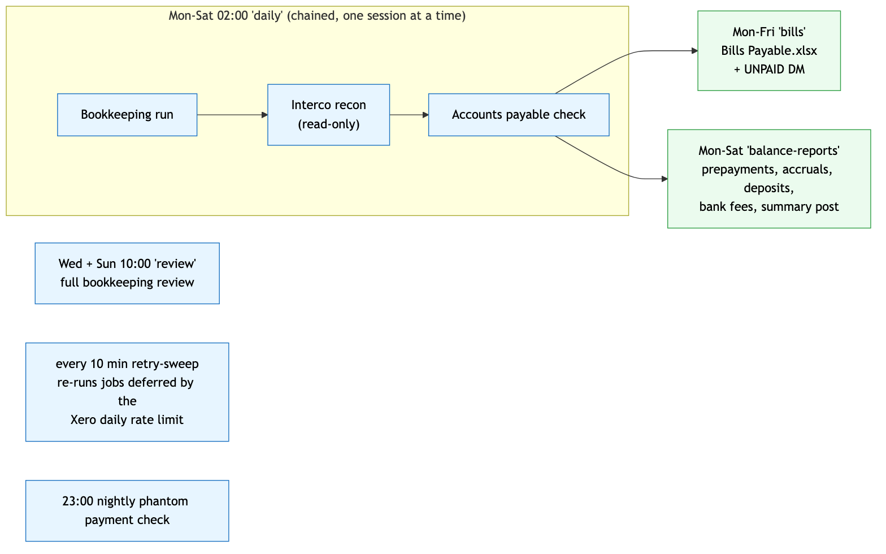

Diagram source (Mermaid, edit this and re-render)

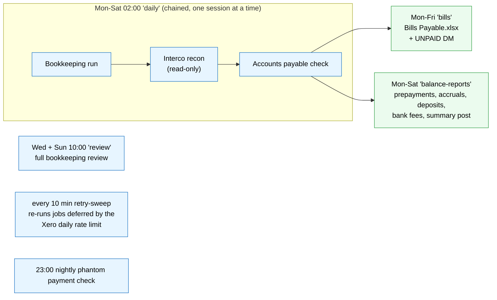

Jobs are chained, not run side by side, so two sessions are never in Xero at
once. Times and prompts: `deploy/crontab.example`, `deploy/run-scheduled.sh`.

---

## 11. Three copies of the repo

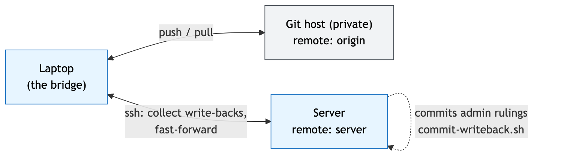

Diagram source (Mermaid, edit this and re-render)

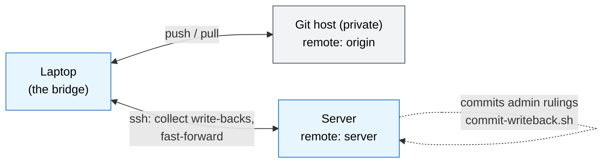

`deploy/sync-all.sh --dry-run` shows which copy has what; without the flag it
collects the server's uncommitted work, merges, pushes and fast-forwards the
server so all three are one commit.
